<!-- markdownlint-capture -->
<!-- markdownlint-disable -->

# Code Metrics

This file is dynamically maintained by a bot, *please do not* edit this by hand. It represents various [code metrics](https://aka.ms/dotnet/code-metrics), such as cyclomatic complexity, maintainability index, and so on.

## Service.LkkPool.Client :heavy_check_mark:

The *Service.LkkPool.Client.csproj* project file contains:

- 1 namespaces.
- 2 named types.
- 26 total lines of source code.
- Approximately 3 lines of executable code.
- The highest cyclomatic complexity is 1 :heavy_check_mark:.

  <strong id="service-lkkpool-client">
    Service.LkkPool.Client :heavy_check_mark:
  </strong>

 

The `Service.LkkPool.Client` namespace contains 2 named types.

- 2 named types.
- 26 total lines of source code.
- Approximately 3 lines of executable code.
- The highest cyclomatic complexity is 1 :heavy_check_mark:.

  <strong id="autofachelper">
    AutofacHelper :heavy_check_mark:
  </strong>

 

- The `AutofacHelper` contains 1 members.
- 9 total lines of source code.
- Approximately 2 lines of executable code.
- The highest cyclomatic complexity is 1 :heavy_check_mark:.

| Member kind | Line number | Maintainability index | Cyclomatic complexity | Depth of inheritance | Class coupling | Lines of source / executable code |
| :-: | :-: | :-: | :-: | :-: | :-: | :-: |
| Method | <a href='https://github.com/MyJetWallet/Service.LkkPool/blob/master/src/Service.LkkPool.Client/AutofacHelper.cs#L10' title='void AutofacHelper.RegisterLkkPoolClient(ContainerBuilder builder, string grpcServiceUrl)'>10</a> | 84 | 1 :heavy_check_mark: | 0 | 4 | 6 / 2 |

<a href="#AutofacHelper-class-diagram">:link: to `AutofacHelper` class diagram</a>

<a href="#service-lkkpool-client">:top: back to Service.LkkPool.Client</a>

  <strong id="lkkpoolclientfactory">
    LkkPoolClientFactory :heavy_check_mark:
  </strong>

 

- The `LkkPoolClientFactory` contains 2 members.
- 9 total lines of source code.
- Approximately 1 lines of executable code.
- The highest cyclomatic complexity is 1 :heavy_check_mark:.

| Member kind | Line number | Maintainability index | Cyclomatic complexity | Depth of inheritance | Class coupling | Lines of source / executable code |
| :-: | :-: | :-: | :-: | :-: | :-: | :-: |
| Method | <a href='https://github.com/MyJetWallet/Service.LkkPool/blob/master/src/Service.LkkPool.Client/LkkPoolClientFactory.cs#L10' title='LkkPoolClientFactory.LkkPoolClientFactory(string grpcServiceUrl)'>10</a> | 100 | 1 :heavy_check_mark: | 0 | 1 | 3 / 0 |
| Method | <a href='https://github.com/MyJetWallet/Service.LkkPool/blob/master/src/Service.LkkPool.Client/LkkPoolClientFactory.cs#L14' title='IHelloService LkkPoolClientFactory.GetHelloService()'>14</a> | 100 | 1 :heavy_check_mark: | 0 | 2 | 1 / 1 |

<a href="#LkkPoolClientFactory-class-diagram">:link: to `LkkPoolClientFactory` class diagram</a>

<a href="#service-lkkpool-client">:top: back to Service.LkkPool.Client</a>

<a href="#service-lkkpool-client">:top: back to Service.LkkPool.Client</a>

## Service.LkkPool.Domain.Models :heavy_check_mark:

The *Service.LkkPool.Domain.Models.csproj* project file contains:

- 1 namespaces.
- 1 named types.
- 7 total lines of source code.
- Approximately 0 lines of executable code.
- The highest cyclomatic complexity is 2 :heavy_check_mark:.

  <strong id="service-lkkpool-domain-models">
    Service.LkkPool.Domain.Models :heavy_check_mark:
  </strong>

 

The `Service.LkkPool.Domain.Models` namespace contains 1 named types.

- 1 named types.
- 7 total lines of source code.
- Approximately 0 lines of executable code.
- The highest cyclomatic complexity is 2 :heavy_check_mark:.

  <strong id="ihellomessage">
    IHelloMessage :heavy_check_mark:
  </strong>

 

- The `IHelloMessage` contains 1 members.
- 4 total lines of source code.
- Approximately 0 lines of executable code.
- The highest cyclomatic complexity is 2 :heavy_check_mark:.

| Member kind | Line number | Maintainability index | Cyclomatic complexity | Depth of inheritance | Class coupling | Lines of source / executable code |
| :-: | :-: | :-: | :-: | :-: | :-: | :-: |
| Property | <a href='https://github.com/MyJetWallet/Service.LkkPool/blob/master/src/Service.LkkPool.Domain.Models/IHelloMessage.cs#L7' title='string IHelloMessage.Message'>7</a> | 100 | 2 :heavy_check_mark: | 0 | 0 | 1 / 0 |

<a href="#IHelloMessage-class-diagram">:link: to `IHelloMessage` class diagram</a>

<a href="#service-lkkpool-domain-models">:top: back to Service.LkkPool.Domain.Models</a>

<a href="#service-lkkpool-domain-models">:top: back to Service.LkkPool.Domain.Models</a>

## Service.LkkPool.Domain :question:

The *Service.LkkPool.Domain.csproj* project file contains:

- 0 namespaces.
- 0 named types.
- 0 total lines of source code.
- Approximately 0 lines of executable code.
- The highest cyclomatic complexity is 0 :question:.

<a href="#service-lkkpool-domain">:top: back to Service.LkkPool.Domain</a>

## Service.LkkPool.Grpc :heavy_check_mark:

The *Service.LkkPool.Grpc.csproj* project file contains:

- 2 namespaces.
- 3 named types.
- 27 total lines of source code.
- Approximately 4 lines of executable code.
- The highest cyclomatic complexity is 2 :heavy_check_mark:.

  <strong id="service-lkkpool-grpc">
    Service.LkkPool.Grpc :heavy_check_mark:
  </strong>

 

The `Service.LkkPool.Grpc` namespace contains 1 named types.

- 1 named types.
- 9 total lines of source code.
- Approximately 0 lines of executable code.
- The highest cyclomatic complexity is 1 :heavy_check_mark:.

  <strong id="ihelloservice">
    IHelloService :heavy_check_mark:
  </strong>

 

- The `IHelloService` contains 1 members.
- 6 total lines of source code.
- Approximately 0 lines of executable code.
- The highest cyclomatic complexity is 1 :heavy_check_mark:.

| Member kind | Line number | Maintainability index | Cyclomatic complexity | Depth of inheritance | Class coupling | Lines of source / executable code |
| :-: | :-: | :-: | :-: | :-: | :-: | :-: |
| Method | <a href='https://github.com/MyJetWallet/Service.LkkPool/blob/master/src/Service.LkkPool.Grpc/IHelloService.cs#L11' title='Task<HelloMessage> IHelloService.SayHelloAsync(HelloRequest request)'>11</a> | 100 | 1 :heavy_check_mark: | 0 | 4 | 2 / 0 |

<a href="#IHelloService-class-diagram">:link: to `IHelloService` class diagram</a>

<a href="#service-lkkpool-grpc">:top: back to Service.LkkPool.Grpc</a>

  <strong id="service-lkkpool-grpc-models">
    Service.LkkPool.Grpc.Models :heavy_check_mark:
  </strong>

 

The `Service.LkkPool.Grpc.Models` namespace contains 2 named types.

- 2 named types.
- 18 total lines of source code.
- Approximately 4 lines of executable code.
- The highest cyclomatic complexity is 2 :heavy_check_mark:.

  <strong id="hellomessage">
    HelloMessage :heavy_check_mark:
  </strong>

 

- The `HelloMessage` contains 1 members.
- 6 total lines of source code.
- Approximately 2 lines of executable code.
- The highest cyclomatic complexity is 2 :heavy_check_mark:.

| Member kind | Line number | Maintainability index | Cyclomatic complexity | Depth of inheritance | Class coupling | Lines of source / executable code |
| :-: | :-: | :-: | :-: | :-: | :-: | :-: |
| Property | <a href='https://github.com/MyJetWallet/Service.LkkPool/blob/master/src/Service.LkkPool.Grpc/Models/HelloMessage.cs#L10' title='string HelloMessage.Message'>10</a> | 100 | 2 :heavy_check_mark: | 0 | 2 | 2 / 2 |

<a href="#HelloMessage-class-diagram">:link: to `HelloMessage` class diagram</a>

<a href="#service-lkkpool-grpc-models">:top: back to Service.LkkPool.Grpc.Models</a>

  <strong id="hellorequest">
    HelloRequest :heavy_check_mark:
  </strong>

 

- The `HelloRequest` contains 1 members.
- 6 total lines of source code.
- Approximately 2 lines of executable code.
- The highest cyclomatic complexity is 2 :heavy_check_mark:.

| Member kind | Line number | Maintainability index | Cyclomatic complexity | Depth of inheritance | Class coupling | Lines of source / executable code |
| :-: | :-: | :-: | :-: | :-: | :-: | :-: |
| Property | <a href='https://github.com/MyJetWallet/Service.LkkPool/blob/master/src/Service.LkkPool.Grpc/Models/HelloRequest.cs#L9' title='string HelloRequest.Name'>9</a> | 100 | 2 :heavy_check_mark: | 0 | 2 | 2 / 2 |

<a href="#HelloRequest-class-diagram">:link: to `HelloRequest` class diagram</a>

<a href="#service-lkkpool-grpc-models">:top: back to Service.LkkPool.Grpc.Models</a>

<a href="#service-lkkpool-grpc">:top: back to Service.LkkPool.Grpc</a>

## Service.LkkPool :exploding_head:

The *Service.LkkPool.csproj* project file contains:

- 5 namespaces.
- 12 named types.
- 777 total lines of source code.
- Approximately 283 lines of executable code.
- The highest cyclomatic complexity is 25 :exploding_head:.

  <strong id="service-lkkpool">
    Service.LkkPool :heavy_check_mark:
  </strong>

 

The `Service.LkkPool` namespace contains 3 named types.

- 3 named types.
- 156 total lines of source code.
- Approximately 52 lines of executable code.
- The highest cyclomatic complexity is 3 :heavy_check_mark:.

  <strong id="applicationlifetimemanager">
    ApplicationLifetimeManager :heavy_check_mark:
  </strong>

 

- The `ApplicationLifetimeManager` contains 6 members.
- 29 total lines of source code.
- Approximately 6 lines of executable code.
- The highest cyclomatic complexity is 1 :heavy_check_mark:.

| Member kind | Line number | Maintainability index | Cyclomatic complexity | Depth of inheritance | Class coupling | Lines of source / executable code |
| :-: | :-: | :-: | :-: | :-: | :-: | :-: |
| Field | <a href='https://github.com/MyJetWallet/Service.LkkPool/blob/master/src/Service.LkkPool/ApplicationLifetimeManager.cs#L10' title='ILogger<ApplicationLifetimeManager> ApplicationLifetimeManager._logger'>10</a> | 100 | 0 :heavy_check_mark: | 0 | 1 | 1 / 0 |
| Field | <a href='https://github.com/MyJetWallet/Service.LkkPool/blob/master/src/Service.LkkPool/ApplicationLifetimeManager.cs#L11' title='PoolManager ApplicationLifetimeManager._poolManager'>11</a> | 100 | 0 :heavy_check_mark: | 0 | 1 | 1 / 0 |
| Method | <a href='https://github.com/MyJetWallet/Service.LkkPool/blob/master/src/Service.LkkPool/ApplicationLifetimeManager.cs#L13' title='ApplicationLifetimeManager.ApplicationLifetimeManager(IHostApplicationLifetime appLifetime, ILogger<ApplicationLifetimeManager> logger, PoolManager poolManager)'>13</a> | 84 | 1 :heavy_check_mark: | 0 | 4 | 7 / 2 |
| Method | <a href='https://github.com/MyJetWallet/Service.LkkPool/blob/master/src/Service.LkkPool/ApplicationLifetimeManager.cs#L21' title='void ApplicationLifetimeManager.OnStarted()'>21</a> | 85 | 1 :heavy_check_mark: | 0 | 4 | 5 / 2 |
| Method | <a href='https://github.com/MyJetWallet/Service.LkkPool/blob/master/src/Service.LkkPool/ApplicationLifetimeManager.cs#L32' title='void ApplicationLifetimeManager.OnStopped()'>32</a> | 97 | 1 :heavy_check_mark: | 0 | 2 | 4 / 1 |
| Method | <a href='https://github.com/MyJetWallet/Service.LkkPool/blob/master/src/Service.LkkPool/ApplicationLifetimeManager.cs#L27' title='void ApplicationLifetimeManager.OnStopping()'>27</a> | 97 | 1 :heavy_check_mark: | 0 | 2 | 4 / 1 |

<a href="#ApplicationLifetimeManager-class-diagram">:link: to `ApplicationLifetimeManager` class diagram</a>

<a href="#service-lkkpool">:top: back to Service.LkkPool</a>

  <strong id="program">
    Program :heavy_check_mark:
  </strong>

 

- The `Program` contains 6 members.
- 69 total lines of source code.
- Approximately 28 lines of executable code.
- The highest cyclomatic complexity is 3 :heavy_check_mark:.

| Member kind | Line number | Maintainability index | Cyclomatic complexity | Depth of inheritance | Class coupling | Lines of source / executable code |
| :-: | :-: | :-: | :-: | :-: | :-: | :-: |
| Method | <a href='https://github.com/MyJetWallet/Service.LkkPool/blob/master/src/Service.LkkPool/Program.cs#L59' title='IHostBuilder Program.CreateHostBuilder(ILoggerFactory loggerFactory, string[] args)'>59</a> | 61 | 3 :heavy_check_mark: | 0 | 5 | 24 / 13 |
| Property | <a href='https://github.com/MyJetWallet/Service.LkkPool/blob/master/src/Service.LkkPool/Program.cs#L21' title='ILoggerFactory Program.LogFactory'>21</a> | 100 | 2 :heavy_check_mark: | 0 | 1 | 1 / 0 |
| Method | <a href='https://github.com/MyJetWallet/Service.LkkPool/blob/master/src/Service.LkkPool/Program.cs#L33' title='void Program.Main(string[] args)'>33</a> | 63 | 1 :heavy_check_mark: | 0 | 6 | 25 / 10 |
| Method | <a href='https://github.com/MyJetWallet/Service.LkkPool/blob/master/src/Service.LkkPool/Program.cs#L23' title='Func<T> Program.ReloadedSettings<T>(Func<SettingsModel, T> getter)'>23</a> | 77 | 1 :heavy_check_mark: | 0 | 4 | 9 / 4 |
| Property | <a href='https://github.com/MyJetWallet/Service.LkkPool/blob/master/src/Service.LkkPool/Program.cs#L19' title='SettingsModel Program.Settings'>19</a> | 100 | 2 :heavy_check_mark: | 0 | 1 | 1 / 0 |
| Field | <a href='https://github.com/MyJetWallet/Service.LkkPool/blob/master/src/Service.LkkPool/Program.cs#L17' title='string Program.SettingsFileName'>17</a> | 93 | 0 :heavy_check_mark: | 0 | 0 | 1 / 1 |

<a href="#Program-class-diagram">:link: to `Program` class diagram</a>

<a href="#service-lkkpool">:top: back to Service.LkkPool</a>

  <strong id="startup">
    Startup :heavy_check_mark:
  </strong>

 

- The `Startup` contains 3 members.
- 49 total lines of source code.
- Approximately 18 lines of executable code.
- The highest cyclomatic complexity is 2 :heavy_check_mark:.

| Member kind | Line number | Maintainability index | Cyclomatic complexity | Depth of inheritance | Class coupling | Lines of source / executable code |
| :-: | :-: | :-: | :-: | :-: | :-: | :-: |
| Method | <a href='https://github.com/MyJetWallet/Service.LkkPool/blob/master/src/Service.LkkPool/Startup.cs#L36' title='void Startup.Configure(IApplicationBuilder app, IWebHostEnvironment env)'>36</a> | 66 | 2 :heavy_check_mark: | 0 | 3 | 27 / 11 |
| Method | <a href='https://github.com/MyJetWallet/Service.LkkPool/blob/master/src/Service.LkkPool/Startup.cs#L64' title='void Startup.ConfigureContainer(ContainerBuilder builder)'>64</a> | 93 | 1 :heavy_check_mark: | 0 | 2 | 5 / 2 |
| Method | <a href='https://github.com/MyJetWallet/Service.LkkPool/blob/master/src/Service.LkkPool/Startup.cs#L23' title='void Startup.ConfigureServices(IServiceCollection services)'>23</a> | 75 | 1 :heavy_check_mark: | 0 | 4 | 12 / 5 |

<a href="#Startup-class-diagram">:link: to `Startup` class diagram</a>

<a href="#service-lkkpool">:top: back to Service.LkkPool</a>

  <strong id="service-lkkpool-modules">
    Service.LkkPool.Modules :heavy_check_mark:
  </strong>

 

The `Service.LkkPool.Modules` namespace contains 2 named types.

- 2 named types.
- 24 total lines of source code.
- Approximately 6 lines of executable code.
- The highest cyclomatic complexity is 1 :heavy_check_mark:.

  <strong id="servicemodule">
    ServiceModule :heavy_check_mark:
  </strong>

 

- The `ServiceModule` contains 1 members.
- 11 total lines of source code.
- Approximately 5 lines of executable code.
- The highest cyclomatic complexity is 1 :heavy_check_mark:.

| Member kind | Line number | Maintainability index | Cyclomatic complexity | Depth of inheritance | Class coupling | Lines of source / executable code |
| :-: | :-: | :-: | :-: | :-: | :-: | :-: |
| Method | <a href='https://github.com/MyJetWallet/Service.LkkPool/blob/master/src/Service.LkkPool/Modules/ServiceModule.cs#L12' title='void ServiceModule.Load(ContainerBuilder builder)'>12</a> | 74 | 1 :heavy_check_mark: | 0 | 6 | 8 / 5 |

<a href="#ServiceModule-class-diagram">:link: to `ServiceModule` class diagram</a>

<a href="#service-lkkpool-modules">:top: back to Service.LkkPool.Modules</a>

  <strong id="settingsmodule">
    SettingsModule :heavy_check_mark:
  </strong>

 

- The `SettingsModule` contains 1 members.
- 7 total lines of source code.
- Approximately 1 lines of executable code.
- The highest cyclomatic complexity is 1 :heavy_check_mark:.

| Member kind | Line number | Maintainability index | Cyclomatic complexity | Depth of inheritance | Class coupling | Lines of source / executable code |
| :-: | :-: | :-: | :-: | :-: | :-: | :-: |
| Method | <a href='https://github.com/MyJetWallet/Service.LkkPool/blob/master/src/Service.LkkPool/Modules/SettingsModule.cs#L7' title='void SettingsModule.Load(ContainerBuilder builder)'>7</a> | 97 | 1 :heavy_check_mark: | 0 | 4 | 4 / 1 |

<a href="#SettingsModule-class-diagram">:link: to `SettingsModule` class diagram</a>

<a href="#service-lkkpool-modules">:top: back to Service.LkkPool.Modules</a>

  <strong id="service-lkkpool-nosql">
    Service.LkkPool.NoSql :heavy_check_mark:
  </strong>

 

The `Service.LkkPool.NoSql` namespace contains 3 named types.

- 3 named types.
- 86 total lines of source code.
- Approximately 8 lines of executable code.
- The highest cyclomatic complexity is 2 :heavy_check_mark:.

  <strong id="configstatus">
    ConfigStatus :heavy_check_mark:
  </strong>

 

- The `ConfigStatus` contains 2 members.
- 5 total lines of source code.
- Approximately 0 lines of executable code.
- The highest cyclomatic complexity is 0 :heavy_check_mark:.

| Member kind | Line number | Maintainability index | Cyclomatic complexity | Depth of inheritance | Class coupling | Lines of source / executable code |
| :-: | :-: | :-: | :-: | :-: | :-: | :-: |
| Field | <a href='https://github.com/MyJetWallet/Service.LkkPool/blob/master/src/Service.LkkPool/NoSql/PoolConfigNoSql.cs#L55' title='ConfigStatus.Active'>55</a> | 100 | 0 :heavy_check_mark: | 0 | 0 | 1 / 0 |
| Field | <a href='https://github.com/MyJetWallet/Service.LkkPool/blob/master/src/Service.LkkPool/NoSql/PoolConfigNoSql.cs#L54' title='ConfigStatus.New'>54</a> | 100 | 0 :heavy_check_mark: | 0 | 0 | 1 / 0 |

<a href="#ConfigStatus-class-diagram">:link: to `ConfigStatus` class diagram</a>

<a href="#service-lkkpool-nosql">:top: back to Service.LkkPool.NoSql</a>

  <strong id="levelmodelnosql">
    LevelModelNoSql :heavy_check_mark:
  </strong>

 

- The `LevelModelNoSql` contains 12 members.
- 30 total lines of source code.
- Approximately 4 lines of executable code.
- The highest cyclomatic complexity is 2 :heavy_check_mark:.

| Member kind | Line number | Maintainability index | Cyclomatic complexity | Depth of inheritance | Class coupling | Lines of source / executable code |
| :-: | :-: | :-: | :-: | :-: | :-: | :-: |
| Property | <a href='https://github.com/MyJetWallet/Service.LkkPool/blob/master/src/Service.LkkPool/NoSql/LevelModel.cs#L26' title='decimal LevelModelNoSql.BuyPrice'>26</a> | 100 | 2 :heavy_check_mark: | 0 | 1 | 1 / 0 |
| Property | <a href='https://github.com/MyJetWallet/Service.LkkPool/blob/master/src/Service.LkkPool/NoSql/LevelModel.cs#L33' title='int LevelModelNoSql.CountBuy'>33</a> | 100 | 2 :heavy_check_mark: | 0 | 0 | 1 / 0 |
| Property | <a href='https://github.com/MyJetWallet/Service.LkkPool/blob/master/src/Service.LkkPool/NoSql/LevelModel.cs#L32' title='int LevelModelNoSql.CountSell'>32</a> | 100 | 2 :heavy_check_mark: | 0 | 0 | 1 / 0 |
| Method | <a href='https://github.com/MyJetWallet/Service.LkkPool/blob/master/src/Service.LkkPool/NoSql/LevelModel.cs#L11' title='LevelModelNoSql LevelModelNoSql.Create(string market, decimal sellPrice)'>11</a> | 93 | 1 :heavy_check_mark: | 0 | 2 | 8 / 1 |
| Method | <a href='https://github.com/MyJetWallet/Service.LkkPool/blob/master/src/Service.LkkPool/NoSql/LevelModel.cs#L8' title='string LevelModelNoSql.GeneratePartitionKey(string project)'>8</a> | 100 | 1 :heavy_check_mark: | 0 | 0 | 1 / 1 |
| Method | <a href='https://github.com/MyJetWallet/Service.LkkPool/blob/master/src/Service.LkkPool/NoSql/LevelModel.cs#L9' title='string LevelModelNoSql.GenerateRowKey(string market)'>9</a> | 100 | 1 :heavy_check_mark: | 0 | 0 | 1 / 1 |
| Property | <a href='https://github.com/MyJetWallet/Service.LkkPool/blob/master/src/Service.LkkPool/NoSql/LevelModel.cs#L20' title='string LevelModelNoSql.Id'>20</a> | 100 | 2 :heavy_check_mark: | 0 | 0 | 1 / 0 |
| Property | <a href='https://github.com/MyJetWallet/Service.LkkPool/blob/master/src/Service.LkkPool/NoSql/LevelModel.cs#L30' title='bool LevelModelNoSql.IsSellMode'>30</a> | 100 | 2 :heavy_check_mark: | 0 | 0 | 1 / 0 |
| Property | <a href='https://github.com/MyJetWallet/Service.LkkPool/blob/master/src/Service.LkkPool/NoSql/LevelModel.cs#L24' title='decimal LevelModelNoSql.SellPrice'>24</a> | 100 | 2 :heavy_check_mark: | 0 | 1 | 1 / 0 |
| Property | <a href='https://github.com/MyJetWallet/Service.LkkPool/blob/master/src/Service.LkkPool/NoSql/LevelModel.cs#L28' title='decimal LevelModelNoSql.StartPrice'>28</a> | 100 | 2 :heavy_check_mark: | 0 | 1 | 1 / 0 |
| Field | <a href='https://github.com/MyJetWallet/Service.LkkPool/blob/master/src/Service.LkkPool/NoSql/LevelModel.cs#L7' title='string LevelModelNoSql.TableName'>7</a> | 93 | 0 :heavy_check_mark: | 0 | 0 | 1 / 1 |
| Property | <a href='https://github.com/MyJetWallet/Service.LkkPool/blob/master/src/Service.LkkPool/NoSql/LevelModel.cs#L22' title='decimal LevelModelNoSql.Volume'>22</a> | 100 | 2 :heavy_check_mark: | 0 | 1 | 1 / 0 |

<a href="#LevelModelNoSql-class-diagram">:link: to `LevelModelNoSql` class diagram</a>

<a href="#service-lkkpool-nosql">:top: back to Service.LkkPool.NoSql</a>

  <strong id="poolconfignosql">
    PoolConfigNoSql :heavy_check_mark:
  </strong>

 

- The `PoolConfigNoSql` contains 19 members.
- 44 total lines of source code.
- Approximately 4 lines of executable code.
- The highest cyclomatic complexity is 2 :heavy_check_mark:.

| Member kind | Line number | Maintainability index | Cyclomatic complexity | Depth of inheritance | Class coupling | Lines of source / executable code |
| :-: | :-: | :-: | :-: | :-: | :-: | :-: |
| Property | <a href='https://github.com/MyJetWallet/Service.LkkPool/blob/master/src/Service.LkkPool/NoSql/PoolConfigNoSql.cs#L26' title='string PoolConfigNoSql.BaseAsset'>26</a> | 100 | 2 :heavy_check_mark: | 0 | 0 | 1 / 0 |
| Property | <a href='https://github.com/MyJetWallet/Service.LkkPool/blob/master/src/Service.LkkPool/NoSql/PoolConfigNoSql.cs#L46' title='decimal PoolConfigNoSql.Capital'>46</a> | 100 | 2 :heavy_check_mark: | 0 | 1 | 1 / 0 |
| Property | <a href='https://github.com/MyJetWallet/Service.LkkPool/blob/master/src/Service.LkkPool/NoSql/PoolConfigNoSql.cs#L36' title='int PoolConfigNoSql.CountLevels'>36</a> | 100 | 2 :heavy_check_mark: | 0 | 0 | 1 / 0 |
| Method | <a href='https://github.com/MyJetWallet/Service.LkkPool/blob/master/src/Service.LkkPool/NoSql/PoolConfigNoSql.cs#L13' title='PoolConfigNoSql PoolConfigNoSql.Create(string project, string market)'>13</a> | 91 | 1 :heavy_check_mark: | 0 | 1 | 8 / 1 |
| Property | <a href='https://github.com/MyJetWallet/Service.LkkPool/blob/master/src/Service.LkkPool/NoSql/PoolConfigNoSql.cs#L44' title='decimal PoolConfigNoSql.FeePercentage'>44</a> | 100 | 2 :heavy_check_mark: | 0 | 1 | 1 / 0 |
| Method | <a href='https://github.com/MyJetWallet/Service.LkkPool/blob/master/src/Service.LkkPool/NoSql/PoolConfigNoSql.cs#L10' title='string PoolConfigNoSql.GeneratePartitionKey(string project)'>10</a> | 100 | 1 :heavy_check_mark: | 0 | 0 | 1 / 1 |
| Method | <a href='https://github.com/MyJetWallet/Service.LkkPool/blob/master/src/Service.LkkPool/NoSql/PoolConfigNoSql.cs#L11' title='string PoolConfigNoSql.GenerateRowKey(string market)'>11</a> | 100 | 1 :heavy_check_mark: | 0 | 0 | 1 / 1 |
| Property | <a href='https://github.com/MyJetWallet/Service.LkkPool/blob/master/src/Service.LkkPool/NoSql/PoolConfigNoSql.cs#L24' title='string PoolConfigNoSql.Instrument'>24</a> | 100 | 2 :heavy_check_mark: | 0 | 0 | 1 / 0 |
| Property | <a href='https://github.com/MyJetWallet/Service.LkkPool/blob/master/src/Service.LkkPool/NoSql/PoolConfigNoSql.cs#L32' title='decimal PoolConfigNoSql.MaxPrice'>32</a> | 100 | 2 :heavy_check_mark: | 0 | 1 | 1 / 0 |
| Property | <a href='https://github.com/MyJetWallet/Service.LkkPool/blob/master/src/Service.LkkPool/NoSql/PoolConfigNoSql.cs#L30' title='decimal PoolConfigNoSql.MinPrice'>30</a> | 100 | 2 :heavy_check_mark: | 0 | 1 | 1 / 0 |
| Property | <a href='https://github.com/MyJetWallet/Service.LkkPool/blob/master/src/Service.LkkPool/NoSql/PoolConfigNoSql.cs#L38' title='decimal PoolConfigNoSql.MinVolume'>38</a> | 100 | 2 :heavy_check_mark: | 0 | 1 | 1 / 0 |
| Property | <a href='https://github.com/MyJetWallet/Service.LkkPool/blob/master/src/Service.LkkPool/NoSql/PoolConfigNoSql.cs#L42' title='int PoolConfigNoSql.PriceAccuracy'>42</a> | 100 | 2 :heavy_check_mark: | 0 | 0 | 1 / 0 |
| Property | <a href='https://github.com/MyJetWallet/Service.LkkPool/blob/master/src/Service.LkkPool/NoSql/PoolConfigNoSql.cs#L28' title='string PoolConfigNoSql.QuoteAsset'>28</a> | 100 | 2 :heavy_check_mark: | 0 | 0 | 1 / 0 |
| Property | <a href='https://github.com/MyJetWallet/Service.LkkPool/blob/master/src/Service.LkkPool/NoSql/PoolConfigNoSql.cs#L34' title='decimal PoolConfigNoSql.StartPrice'>34</a> | 100 | 2 :heavy_check_mark: | 0 | 1 | 1 / 0 |
| Property | <a href='https://github.com/MyJetWallet/Service.LkkPool/blob/master/src/Service.LkkPool/NoSql/PoolConfigNoSql.cs#L49' title='DateTime PoolConfigNoSql.StartTime'>49</a> | 100 | 2 :heavy_check_mark: | 0 | 1 | 1 / 0 |
| Property | <a href='https://github.com/MyJetWallet/Service.LkkPool/blob/master/src/Service.LkkPool/NoSql/PoolConfigNoSql.cs#L48' title='ConfigStatus PoolConfigNoSql.Status'>48</a> | 100 | 2 :heavy_check_mark: | 0 | 1 | 1 / 0 |
| Field | <a href='https://github.com/MyJetWallet/Service.LkkPool/blob/master/src/Service.LkkPool/NoSql/PoolConfigNoSql.cs#L9' title='string PoolConfigNoSql.TableName'>9</a> | 93 | 0 :heavy_check_mark: | 0 | 0 | 1 / 1 |
| Property | <a href='https://github.com/MyJetWallet/Service.LkkPool/blob/master/src/Service.LkkPool/NoSql/PoolConfigNoSql.cs#L22' title='string PoolConfigNoSql.UniqueId'>22</a> | 100 | 2 :heavy_check_mark: | 0 | 0 | 1 / 0 |
| Property | <a href='https://github.com/MyJetWallet/Service.LkkPool/blob/master/src/Service.LkkPool/NoSql/PoolConfigNoSql.cs#L40' title='int PoolConfigNoSql.VolumeAccuracy'>40</a> | 100 | 2 :heavy_check_mark: | 0 | 0 | 1 / 0 |

<a href="#PoolConfigNoSql-class-diagram">:link: to `PoolConfigNoSql` class diagram</a>

<a href="#service-lkkpool-nosql">:top: back to Service.LkkPool.NoSql</a>

  <strong id="service-lkkpool-services">
    Service.LkkPool.Services :exploding_head:
  </strong>

 

The `Service.LkkPool.Services` namespace contains 3 named types.

- 3 named types.
- 444 total lines of source code.
- Approximately 177 lines of executable code.
- The highest cyclomatic complexity is 25 :exploding_head:.

  <strong id="helloservice">
    HelloService :heavy_check_mark:
  </strong>

 

- The `HelloService` contains 3 members.
- 19 total lines of source code.
- Approximately 3 lines of executable code.
- The highest cyclomatic complexity is 1 :heavy_check_mark:.

| Member kind | Line number | Maintainability index | Cyclomatic complexity | Depth of inheritance | Class coupling | Lines of source / executable code |
| :-: | :-: | :-: | :-: | :-: | :-: | :-: |
| Field | <a href='https://github.com/MyJetWallet/Service.LkkPool/blob/master/src/Service.LkkPool/Services/HelloService.cs#L12' title='ILogger<HelloService> HelloService._logger'>12</a> | 100 | 0 :heavy_check_mark: | 0 | 1 | 1 / 0 |
| Method | <a href='https://github.com/MyJetWallet/Service.LkkPool/blob/master/src/Service.LkkPool/Services/HelloService.cs#L14' title='HelloService.HelloService(ILogger<HelloService> logger)'>14</a> | 96 | 1 :heavy_check_mark: | 0 | 1 | 4 / 1 |
| Method | <a href='https://github.com/MyJetWallet/Service.LkkPool/blob/master/src/Service.LkkPool/Services/HelloService.cs#L19' title='Task<HelloMessage> HelloService.SayHelloAsync(HelloRequest request)'>19</a> | 84 | 1 :heavy_check_mark: | 0 | 5 | 9 / 2 |

<a href="#HelloService-class-diagram">:link: to `HelloService` class diagram</a>

<a href="#service-lkkpool-services">:top: back to Service.LkkPool.Services</a>

  <strong id="poolmanager">
    PoolManager :exploding_head:
  </strong>

 

- The `PoolManager` contains 14 members.
- 383 total lines of source code.
- Approximately 166 lines of executable code.
- The highest cyclomatic complexity is 25 :exploding_head:.

| Member kind | Line number | Maintainability index | Cyclomatic complexity | Depth of inheritance | Class coupling | Lines of source / executable code |
| :-: | :-: | :-: | :-: | :-: | :-: | :-: |
| Field | <a href='https://github.com/MyJetWallet/Service.LkkPool/blob/master/src/Service.LkkPool/Services/PoolManager.cs#L20' title='TradingApiClient PoolManager._client'>20</a> | 100 | 0 :heavy_check_mark: | 0 | 1 | 1 / 0 |
| Field | <a href='https://github.com/MyJetWallet/Service.LkkPool/blob/master/src/Service.LkkPool/Services/PoolManager.cs#L19' title='PoolConfigNoSql PoolManager._config'>19</a> | 100 | 0 :heavy_check_mark: | 0 | 1 | 1 / 0 |
| Field | <a href='https://github.com/MyJetWallet/Service.LkkPool/blob/master/src/Service.LkkPool/Services/PoolManager.cs#L17' title='IMyNoSqlServerDataWriter<PoolConfigNoSql> PoolManager._configWriter'>17</a> | 100 | 0 :heavy_check_mark: | 0 | 2 | 1 / 0 |
| Field | <a href='https://github.com/MyJetWallet/Service.LkkPool/blob/master/src/Service.LkkPool/Services/PoolManager.cs#L22' title='DateTime PoolManager._lastTradeTime'>22</a> | 93 | 0 :heavy_check_mark: | 0 | 2 | 1 / 1 |
| Field | <a href='https://github.com/MyJetWallet/Service.LkkPool/blob/master/src/Service.LkkPool/Services/PoolManager.cs#L23' title='List<LevelModelNoSql> PoolManager._levels'>23</a> | 100 | 0 :heavy_check_mark: | 0 | 2 | 1 / 0 |
| Field | <a href='https://github.com/MyJetWallet/Service.LkkPool/blob/master/src/Service.LkkPool/Services/PoolManager.cs#L18' title='IMyNoSqlServerDataWriter<LevelModelNoSql> PoolManager._levelWriter'>18</a> | 100 | 0 :heavy_check_mark: | 0 | 2 | 1 / 0 |
| Field | <a href='https://github.com/MyJetWallet/Service.LkkPool/blob/master/src/Service.LkkPool/Services/PoolManager.cs#L16' title='ILogger<PoolManager> PoolManager._logger'>16</a> | 100 | 0 :heavy_check_mark: | 0 | 1 | 1 / 0 |
| Field | <a href='https://github.com/MyJetWallet/Service.LkkPool/blob/master/src/Service.LkkPool/Services/PoolManager.cs#L21' title='MyTaskTimer PoolManager._timer'>21</a> | 100 | 0 :heavy_check_mark: | 0 | 1 | 1 / 0 |
| Method | <a href='https://github.com/MyJetWallet/Service.LkkPool/blob/master/src/Service.LkkPool/Services/PoolManager.cs#L25' title='PoolManager.PoolManager(ILogger<PoolManager> logger, IMyNoSqlServerDataWriter<PoolConfigNoSql> configWriter, IMyNoSqlServerDataWriter<LevelModelNoSql> levelWriter)'>25</a> | 74 | 1 :heavy_check_mark: | 0 | 6 | 9 / 4 |
| Method | <a href='https://github.com/MyJetWallet/Service.LkkPool/blob/master/src/Service.LkkPool/Services/PoolManager.cs#L195' title='Task PoolManager.GenerateNewMarket(PoolConfigNoSql config)'>195</a> | 30 | 25 :exploding_head: | 0 | 19 | 175 / 84 |
| Method | <a href='https://github.com/MyJetWallet/Service.LkkPool/blob/master/src/Service.LkkPool/Services/PoolManager.cs#L371' title='PoolConfigNoSql PoolManager.GetConfig()'>371</a> | 67 | 3 :heavy_check_mark: | 0 | 5 | 19 / 6 |
| Method | <a href='https://github.com/MyJetWallet/Service.LkkPool/blob/master/src/Service.LkkPool/Services/PoolManager.cs#L35' title='Task PoolManager.HandleTrades()'>35</a> | 42 | 15 :exploding_head: | 0 | 15 | 121 / 45 |
| Method | <a href='https://github.com/MyJetWallet/Service.LkkPool/blob/master/src/Service.LkkPool/Services/PoolManager.cs#L391' title='void PoolManager.SaveConfig(PoolConfigNoSql config)'>391</a> | 86 | 1 :heavy_check_mark: | 0 | 3 | 5 / 2 |
| Method | <a href='https://github.com/MyJetWallet/Service.LkkPool/blob/master/src/Service.LkkPool/Services/PoolManager.cs#L157' title='Task PoolManager.Start()'>157</a> | 49 | 3 :heavy_check_mark: | 0 | 14 | 37 / 24 |

<a href="#PoolManager-class-diagram">:link: to `PoolManager` class diagram</a>

<a href="#service-lkkpool-services">:top: back to Service.LkkPool.Services</a>

  <strong id="tradingapiclient">
    TradingApiClient :heavy_check_mark:
  </strong>

 

- The `TradingApiClient` contains 5 members.
- 33 total lines of source code.
- Approximately 8 lines of executable code.
- The highest cyclomatic complexity is 2 :heavy_check_mark:.

| Member kind | Line number | Maintainability index | Cyclomatic complexity | Depth of inheritance | Class coupling | Lines of source / executable code |
| :-: | :-: | :-: | :-: | :-: | :-: | :-: |
| Method | <a href='https://github.com/MyJetWallet/Service.LkkPool/blob/master/src/Service.LkkPool/Services/TradingApiClient.cs#L18' title='TradingApiClient.TradingApiClient(string grpcUrl, string apiKey)'>18</a> | 66 | 2 :heavy_check_mark: | 0 | 7 | 22 / 8 |
| Property | <a href='https://github.com/MyJetWallet/Service.LkkPool/blob/master/src/Service.LkkPool/Services/TradingApiClient.cs#L10' title='GrpcChannel TradingApiClient.Channel'>10</a> | 100 | 1 :heavy_check_mark: | 0 | 1 | 1 / 0 |
| Property | <a href='https://github.com/MyJetWallet/Service.LkkPool/blob/master/src/Service.LkkPool/Services/TradingApiClient.cs#L16' title='MonitoringClient TradingApiClient.MonitoringApi'>16</a> | 100 | 2 :heavy_check_mark: | 0 | 2 | 1 / 0 |
| Property | <a href='https://github.com/MyJetWallet/Service.LkkPool/blob/master/src/Service.LkkPool/Services/TradingApiClient.cs#L14' title='PrivateServiceClient TradingApiClient.PrivateApi'>14</a> | 100 | 2 :heavy_check_mark: | 0 | 2 | 1 / 0 |
| Property | <a href='https://github.com/MyJetWallet/Service.LkkPool/blob/master/src/Service.LkkPool/Services/TradingApiClient.cs#L12' title='PublicServiceClient TradingApiClient.PublicApi'>12</a> | 100 | 2 :heavy_check_mark: | 0 | 2 | 1 / 0 |

<a href="#TradingApiClient-class-diagram">:link: to `TradingApiClient` class diagram</a>

<a href="#service-lkkpool-services">:top: back to Service.LkkPool.Services</a>

  <strong id="service-lkkpool-settings">
    Service.LkkPool.Settings :heavy_check_mark:
  </strong>

 

The `Service.LkkPool.Settings` namespace contains 1 named types.

- 1 named types.
- 67 total lines of source code.
- Approximately 40 lines of executable code.
- The highest cyclomatic complexity is 2 :heavy_check_mark:.

  <strong id="settingsmodel">
    SettingsModel :heavy_check_mark:
  </strong>

 

- The `SettingsModel` contains 20 members.
- 64 total lines of source code.
- Approximately 40 lines of executable code.
- The highest cyclomatic complexity is 2 :heavy_check_mark:.

| Member kind | Line number | Maintainability index | Cyclomatic complexity | Depth of inheritance | Class coupling | Lines of source / executable code |
| :-: | :-: | :-: | :-: | :-: | :-: | :-: |
| Property | <a href='https://github.com/MyJetWallet/Service.LkkPool/blob/master/src/Service.LkkPool/Settings/SettingsModel.cs#L27' title='string SettingsModel.ApiKey'>27</a> | 100 | 2 :heavy_check_mark: | 0 | 1 | 2 / 2 |
| Property | <a href='https://github.com/MyJetWallet/Service.LkkPool/blob/master/src/Service.LkkPool/Settings/SettingsModel.cs#L36' title='string SettingsModel.BaseAsset'>36</a> | 100 | 2 :heavy_check_mark: | 0 | 1 | 2 / 2 |
| Property | <a href='https://github.com/MyJetWallet/Service.LkkPool/blob/master/src/Service.LkkPool/Settings/SettingsModel.cs#L66' title='string SettingsModel.Capital'>66</a> | 100 | 2 :heavy_check_mark: | 0 | 1 | 2 / 2 |
| Property | <a href='https://github.com/MyJetWallet/Service.LkkPool/blob/master/src/Service.LkkPool/Settings/SettingsModel.cs#L51' title='int SettingsModel.CountLevels'>51</a> | 100 | 2 :heavy_check_mark: | 0 | 1 | 2 / 2 |
| Property | <a href='https://github.com/MyJetWallet/Service.LkkPool/blob/master/src/Service.LkkPool/Settings/SettingsModel.cs#L15' title='LogElkSettings SettingsModel.ElkLogs'>15</a> | 100 | 2 :heavy_check_mark: | 0 | 2 | 2 / 2 |
| Property | <a href='https://github.com/MyJetWallet/Service.LkkPool/blob/master/src/Service.LkkPool/Settings/SettingsModel.cs#L63' title='string SettingsModel.FeePercentage'>63</a> | 100 | 2 :heavy_check_mark: | 0 | 1 | 2 / 2 |
| Property | <a href='https://github.com/MyJetWallet/Service.LkkPool/blob/master/src/Service.LkkPool/Settings/SettingsModel.cs#L33' title='string SettingsModel.Instrument'>33</a> | 100 | 2 :heavy_check_mark: | 0 | 1 | 2 / 2 |
| Property | <a href='https://github.com/MyJetWallet/Service.LkkPool/blob/master/src/Service.LkkPool/Settings/SettingsModel.cs#L24' title='string SettingsModel.Market'>24</a> | 100 | 2 :heavy_check_mark: | 0 | 1 | 2 / 2 |
| Property | <a href='https://github.com/MyJetWallet/Service.LkkPool/blob/master/src/Service.LkkPool/Settings/SettingsModel.cs#L45' title='string SettingsModel.MaxPrice'>45</a> | 100 | 2 :heavy_check_mark: | 0 | 1 | 2 / 2 |
| Property | <a href='https://github.com/MyJetWallet/Service.LkkPool/blob/master/src/Service.LkkPool/Settings/SettingsModel.cs#L42' title='string SettingsModel.MinPrice'>42</a> | 100 | 2 :heavy_check_mark: | 0 | 1 | 2 / 2 |
| Property | <a href='https://github.com/MyJetWallet/Service.LkkPool/blob/master/src/Service.LkkPool/Settings/SettingsModel.cs#L54' title='string SettingsModel.MinVolume'>54</a> | 100 | 2 :heavy_check_mark: | 0 | 1 | 2 / 2 |
| Property | <a href='https://github.com/MyJetWallet/Service.LkkPool/blob/master/src/Service.LkkPool/Settings/SettingsModel.cs#L18' title='string SettingsModel.NoSqlWriterUrl'>18</a> | 100 | 2 :heavy_check_mark: | 0 | 1 | 2 / 2 |
| Property | <a href='https://github.com/MyJetWallet/Service.LkkPool/blob/master/src/Service.LkkPool/Settings/SettingsModel.cs#L60' title='int SettingsModel.PriceAccuracy'>60</a> | 100 | 2 :heavy_check_mark: | 0 | 1 | 2 / 2 |
| Property | <a href='https://github.com/MyJetWallet/Service.LkkPool/blob/master/src/Service.LkkPool/Settings/SettingsModel.cs#L21' title='string SettingsModel.Project'>21</a> | 100 | 2 :heavy_check_mark: | 0 | 1 | 2 / 2 |
| Property | <a href='https://github.com/MyJetWallet/Service.LkkPool/blob/master/src/Service.LkkPool/Settings/SettingsModel.cs#L39' title='string SettingsModel.QuoteAsset'>39</a> | 100 | 2 :heavy_check_mark: | 0 | 1 | 2 / 2 |
| Property | <a href='https://github.com/MyJetWallet/Service.LkkPool/blob/master/src/Service.LkkPool/Settings/SettingsModel.cs#L9' title='string SettingsModel.SeqServiceUrl'>9</a> | 100 | 2 :heavy_check_mark: | 0 | 1 | 2 / 2 |
| Property | <a href='https://github.com/MyJetWallet/Service.LkkPool/blob/master/src/Service.LkkPool/Settings/SettingsModel.cs#L48' title='string SettingsModel.StartPrice'>48</a> | 100 | 2 :heavy_check_mark: | 0 | 1 | 2 / 2 |
| Property | <a href='https://github.com/MyJetWallet/Service.LkkPool/blob/master/src/Service.LkkPool/Settings/SettingsModel.cs#L30' title='string SettingsModel.UniqueId'>30</a> | 100 | 2 :heavy_check_mark: | 0 | 1 | 2 / 2 |
| Property | <a href='https://github.com/MyJetWallet/Service.LkkPool/blob/master/src/Service.LkkPool/Settings/SettingsModel.cs#L57' title='int SettingsModel.VolumeAccuracy'>57</a> | 100 | 2 :heavy_check_mark: | 0 | 1 | 2 / 2 |
| Property | <a href='https://github.com/MyJetWallet/Service.LkkPool/blob/master/src/Service.LkkPool/Settings/SettingsModel.cs#L12' title='string SettingsModel.ZipkinUrl'>12</a> | 100 | 2 :heavy_check_mark: | 0 | 1 | 2 / 2 |

<a href="#SettingsModel-class-diagram">:link: to `SettingsModel` class diagram</a>

<a href="#service-lkkpool-settings">:top: back to Service.LkkPool.Settings</a>

<a href="#service-lkkpool">:top: back to Service.LkkPool</a>

## Metric definitions

  - **Maintainability index**: Measures ease of code maintenance. Higher values are better.
  - **Cyclomatic complexity**: Measures the number of branches. Lower values are better.
  - **Depth of inheritance**: Measures length of object inheritance hierarchy. Lower values are better.
  - **Class coupling**: Measures the number of classes that are referenced. Lower values are better.
  - **Lines of source code**: Exact number of lines of source code. Lower values are better.
  - **Lines of executable code**: Approximates the lines of executable code. Lower values are better.

## Mermaid class diagrams

##### `AutofacHelper` class diagram

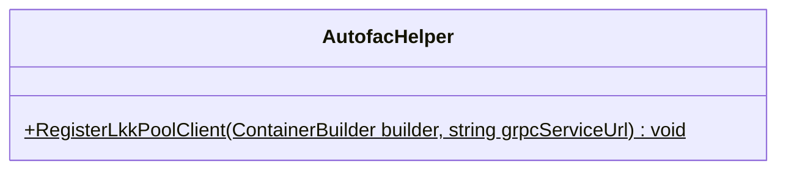

##### `LkkPoolClientFactory` class diagram

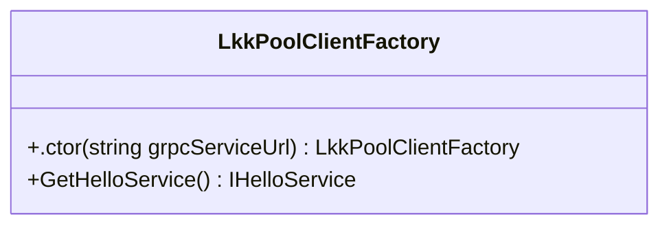

##### `IHelloMessage` class diagram

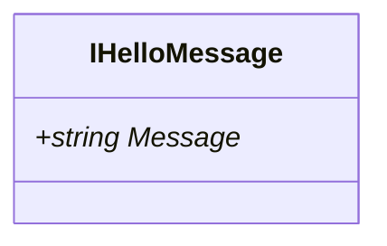

##### `IHelloService` class diagram

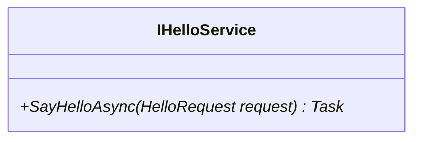

##### `HelloMessage` class diagram

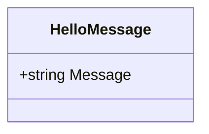

##### `HelloRequest` class diagram

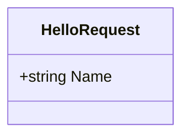

##### `ApplicationLifetimeManager` class diagram

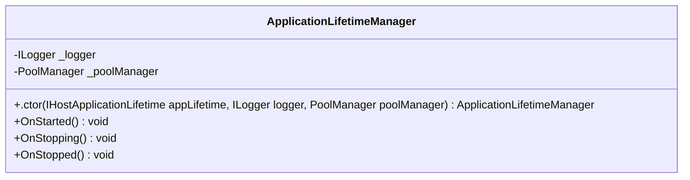

##### `Program` class diagram

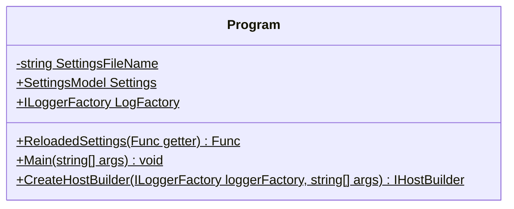

##### `Startup` class diagram

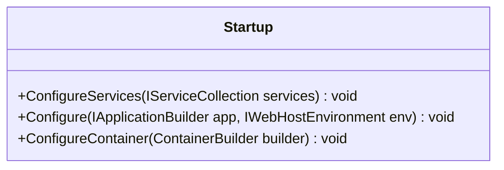

##### `ServiceModule` class diagram

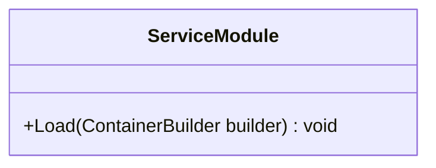

##### `SettingsModule` class diagram

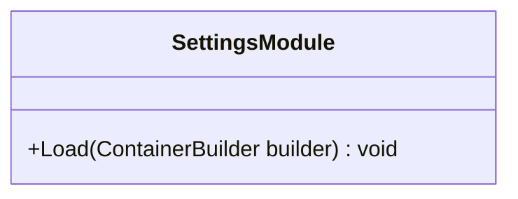

##### `ConfigStatus` class diagram

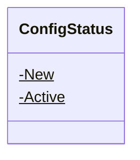

##### `LevelModelNoSql` class diagram

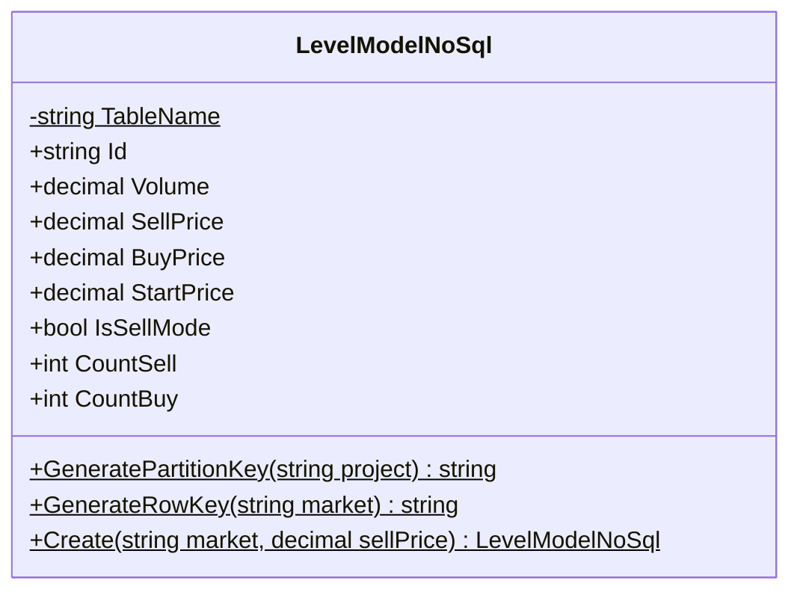

##### `PoolConfigNoSql` class diagram

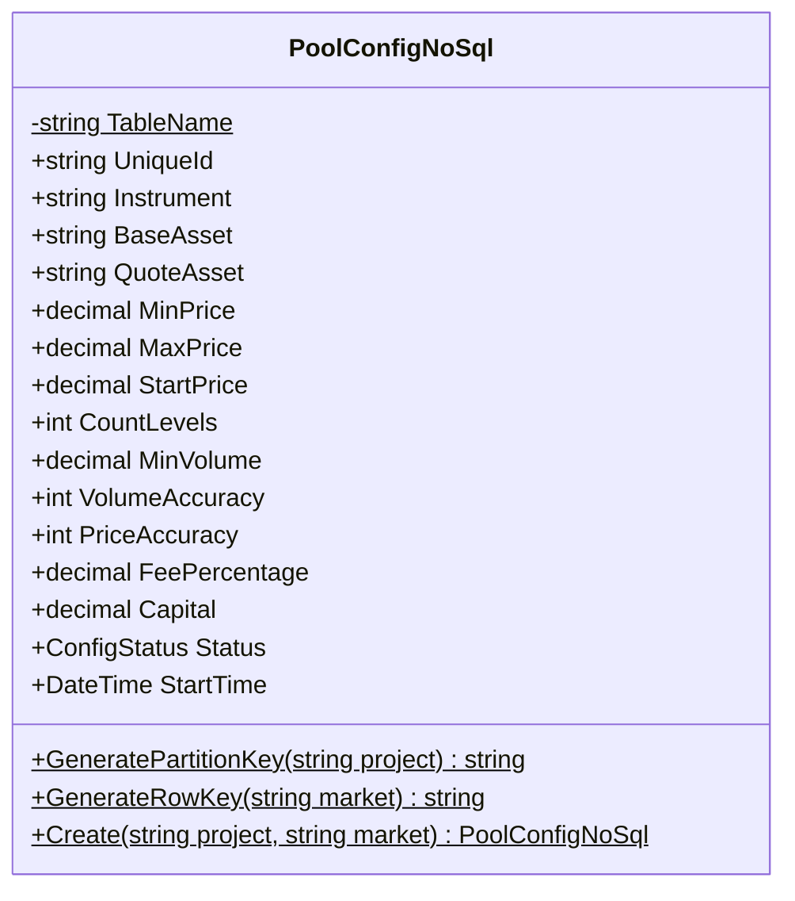

##### `HelloService` class diagram

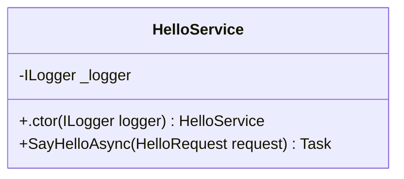

##### `PoolManager` class diagram

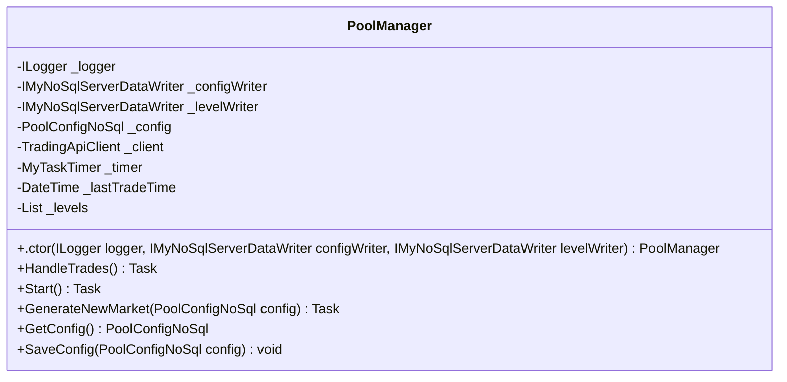

##### `TradingApiClient` class diagram

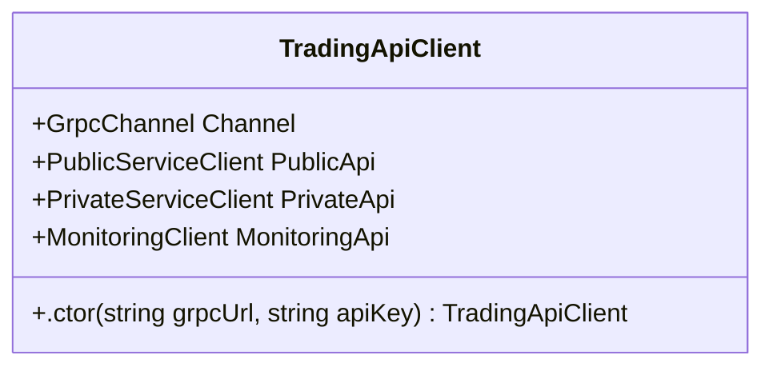

##### `SettingsModel` class diagram

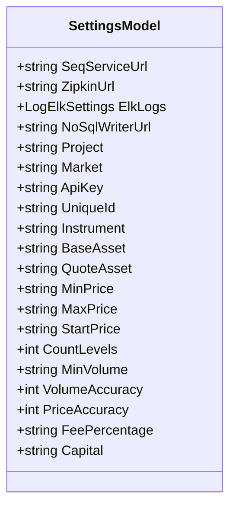

*This file is maintained by a bot.*

<!-- markdownlint-restore -->
